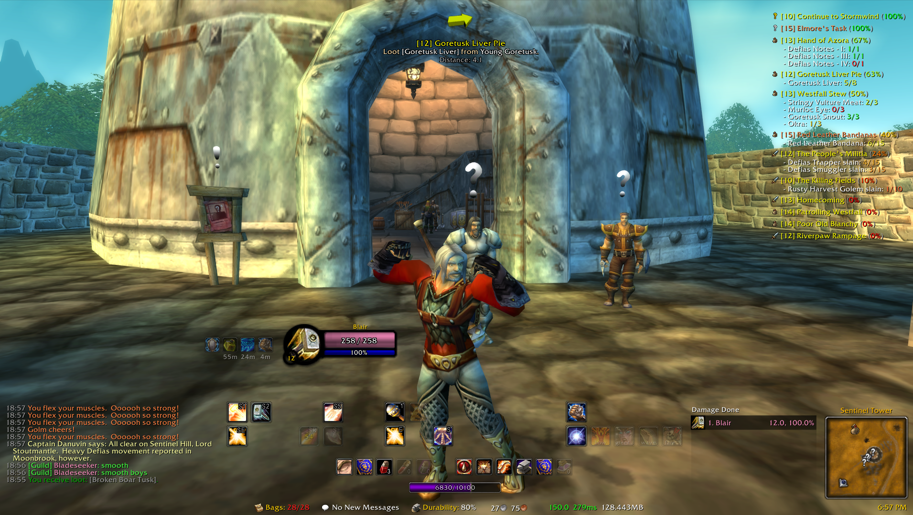

# Overview 
```
Project Epoch UI
Client Version: 3.3.5
```


---
## Installation Instructions
1. Download the respective addons from the Addon List from Waperia or Felbite.

2. Add the addons under your Addons folder.
```
World of Warcraft\Project Epoch\Interface\AddOns
```

3. Replace your WTF folder with the WTF folder from this repo.
```
World of Warcraft\Project Epoch\WTF
```

4. Rename {ACCOUNTNAME} to your account name.
```
World of Warcraft\Project Epoch\WTF\Account\{ACCOUNTNAME}
```

5. Rename {CHARACTERNAME} to your character name.
```
World of Warcraft\Project Epoch\WTF\Account\{ACCOUNTNAME}\Kezan\{CHARACTERNAME}
```

6. Most profiles should be set to default. However, if you encounter issues, you should run through the addon profiles and set it to default or to "Woke".

---
## Addon List
```
- Classic API
- Addon Control Panel
- AddFriend
- Align
- AngryAssignment
- Auctionator
- Bagnon
- BigDebuff
- BlizzMove
- BNet Toast
- Clique
- Compact Raid Frames
- Compact Raid Frames HealEx
- Details
- Details Tiny Threat
- DimmedActions
- Dominos
- Doom Cooldown Pulse
- Easy Frames
- Enhanced Raid Frames
- Group Bulletin Board
- Icetip
- Immersion
- Leatrix Plus
- LibHealComm
- Magnify WotLK
- Mapster
- Masque
- MikScrollingBattleText
- Misspelled
- MoveAnything
- NotPlater-3.3.5
- ObjectiveAnnouncer
- OmniCC
- PallyPower
- pfQuest-epoch
- pfQuest-wotlk
- Postal
- Prat
- Raven
- SexyMap
- SharedMedia
- SpeedyActions
- TitanPanel
- WeakAuras
- WhatsTraining_WotLK
- WIM
```

---
### Links
- [Warperia](https://warperia.com/)
- [Felbite](https://felbite.com/)